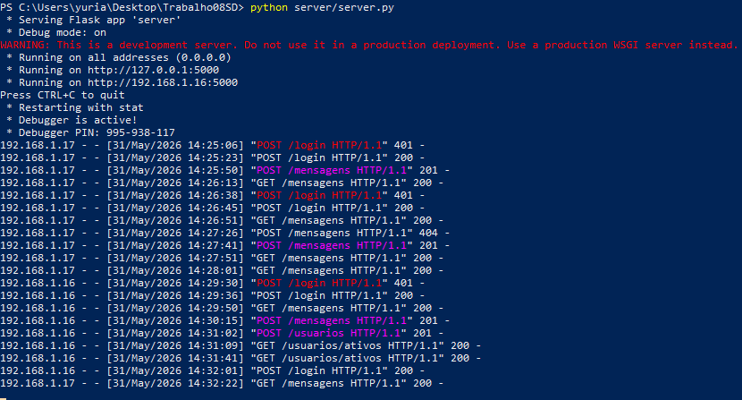
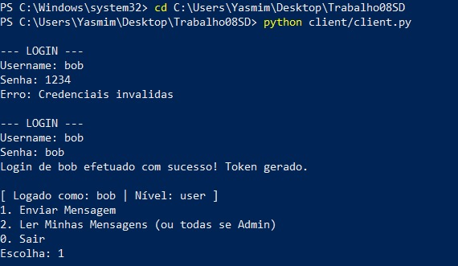
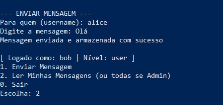
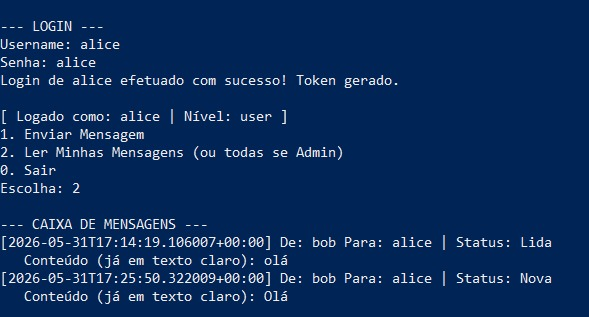
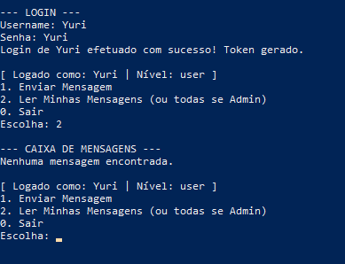
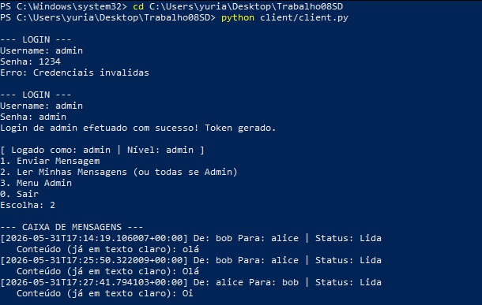
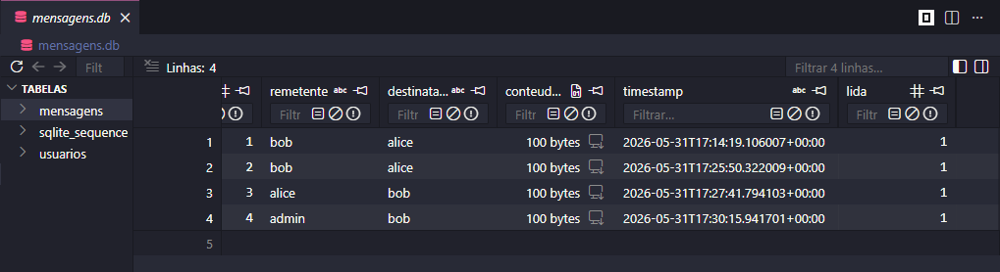
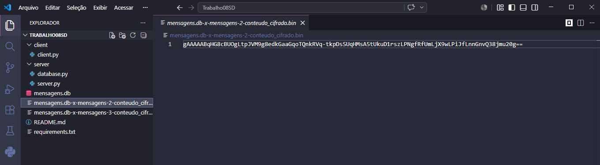

# Sistema Distribuído Seguro de Mensagens

## Arquitetura de Segurança Implementada
Este sistema consiste em um servidor centralizado (Flask) e clientes interativos de terminal. Ele implementa os três pilares solicitados:
1. **Autenticação:** Baseada em tokens. Senhas salvas com hash `SHA-256`. A cada login bem sucedido, o servidor emite um token (gerado via `secrets`) que passa a ser exigido no cabeçalho (`Authorization`) das requisições.
2. **Criptografia:** O envio de mensagens usa criptografia simétrica com `Fernet`. O Cliente A criptografa o texto antes de enviá-lo à rede. O banco SQLite armazena a string em formato `BLOB` ininteligível. Ao ser requisitada via endpoint, o servidor descriptografa a mensagem e a entrega legível ao Cliente B.
3. **Controle de Acesso:** Implementado via decorators (`@token_required` e `@admin_required`). Usuários comuns acessam e dão baixa em suas próprias mensagens. O perfil `admin` visualiza o tráfego total, cadastra novos logins e monitora sessões ativas na memória do servidor.

## Instruções de Instalação

1. Clone ou extraia o projeto.
2. Crie e ative um ambiente virtual (recomendado):
   ```bash
   python -m venv venv
   source venv/bin/activate  # No Linux/Mac
   # venv\Scripts\activate   # No Windows
   ```

3. Instale as dependências:
```bash
pip install -r requirements.txt
```
Passo a Passo de Execução
Inicialize o banco de dados (Cria o arquivo mensagens.db e usuários padrão: admin, alice, bob):
```bash
python server/database.py
```


Inicie o servidor:
```bash
python server/server.py
```

Em um novo terminal, inicie o cliente (Notebook A):
```bash
python client/client.py
```

Em outro terminal, inicie o cliente (Notebook B), e repita o comando acima.
```bash
python client/client.py
```
## Print dos testes
**Rodando o servidor**



**Teste de credenciais**



**Envio de mensagem**



**Visualização de mensagem**



**Usuário sem mensagem**



**Visualização de mensagens pelo Admin**



**Mensagens salvas no banco de dados**



**Criptografia das mensagens no banco de dados**




